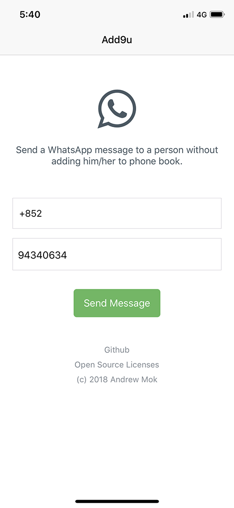

# Add9u for WhatsApp: React Native version for iOS

> It is so stupid that I have to add a new person every time to phone book because I want to send a WhatsApp message to him/her.
> 
> That's why I make this simple react native mobile application. It allows you to send a WhatsApp message to a person without adding him/her to the phone book.



## Clone & Install
The instructions below will get you a copy of the project up and run on your machine.

Clone the repo, and run:
``` bash
# install global dependencies (if you don't have)
brew install node
brew install watchman
npm install -g react-native-cli
npm install -g flow-typed

# install dependencies
npm install

# open the app in the iOS Simulator (require XCode installed)
npm run ios
```

## Coding Standard

- [JavaScript Standard Style](https://standardjs.com)

## Built With
- [Axios](https://github.com/axios/axios)
- [ESLint](https://eslint.org)
- [Flow](https://flow.org)
- [Flow-typed](https://github.com/flowtype/flow-typed)
- [Nativebase](https://nativebase.io)
- [Prop-types](https://github.com/facebook/prop-types)
- [React](https://reactjs.org)
- [React Native](https://facebook.github.io/react-native)
- [React Native Check App Install](https://github.com/redpandatronicsuk/react-native-check-app-install)
- [React Native Simple Picker](https://github.com/puredazzle/react-native-simple-picker)
- [React Native Vector Icons](https://github.com/oblador/react-native-vector-icons)
- [React Navigation](https://reactnavigation.org)

## Author

- [Andrew Mok](https://andrewmmc.com) (@andrewmmc)

## Declaration
This is NOT an official product by WhatsApp Inc. Any communication between users and WhatsApp servers is handled by official WhatsApp application. It only provides a shortcut for users to open official WhatsApp application by using API links.

## Questions?
- If you have any questions, please feel free to [contact me via email](mailto:hello@andrewmmc.com).
